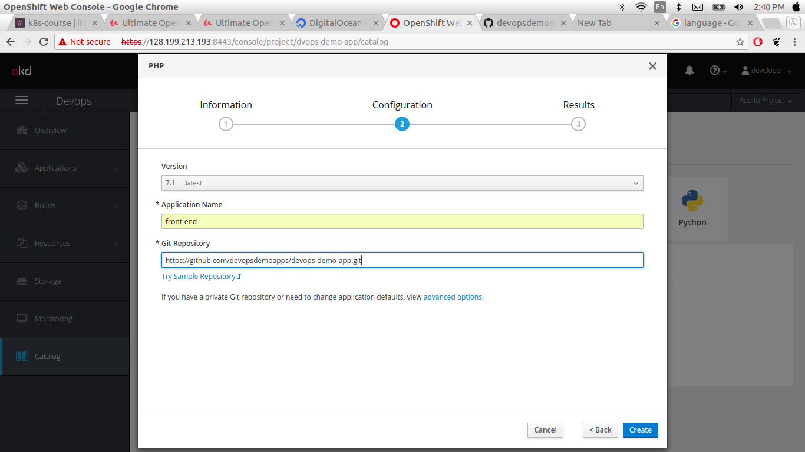
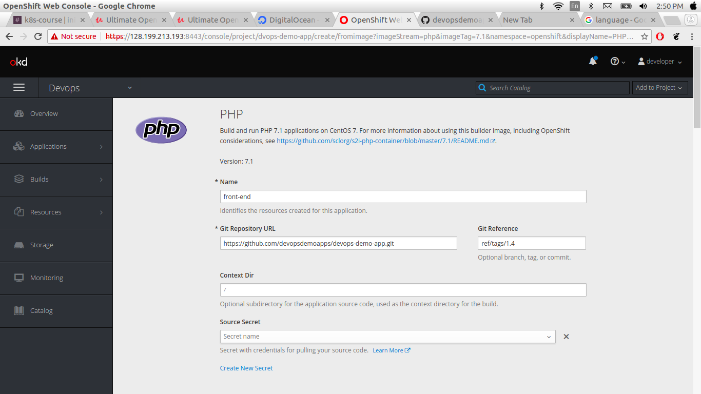

## Deploying Devops Demo PHP Application for GitHub Repo
In this section we are deploying sample devops demo PHP app from GitHub repo.
we use the same cluster earlier deployed simple aaplication with diffrent project namespace.
This docs demonstrates how to get a simple project up and running on OpenShift. Application that will serve a welcome page Welcome to the DevOps Demo Application.

* Go to Home Page.
* click on create project.
* Enter the project name Display name and describtions.


After creating the project namespace swaitch to yor new project name space you can see here new worksapce.


* click the Browse catalog you can see here multiple programming languages and databases.
* select the php you can see here php+mysql and only php choose php


* After selecting the language provide the information ,
configuration

   * In configuration you can provides version of the programming language and following GitHub repo.

```
https://github.com/devopsdemoapps/devops-demo-app.git
```


* click on the Advance option

In this section yoc can provides following options.
* reference

* Tag

* Routing

* Deployment Configuration

* scaling

* Resource Limit

* Labels



 Then click create project. After create project automated build build your project .
 In the web console, view the Overview page for your project to determine the web address for your application. Click the web address displayed right side web console open this link on new tab.

 


 ### OpenShift CommandLine
 When we are using OpenShift many of the tasks that you need to do can be performed through the OpenShift web Broser console or directly using the oc command line tool. or you can observe here backed utility.

 In this case we need the OpenShift token . we can create token using opnshift web console click on user Devloper and there is option copy login command click on this paste on your console.

 

 ```
  oc login https://128.199.213.193:8443 --token=< your token>
 ```
 [output]
 ```
 Logged into "https://128.199.213.193:8443" as "developer" using the token provided.
You have access to the following projects and can switch between them with 'oc project <projectname>':
    devops-demo-app
  * myproject
Using project "myproject".
 ```
 here display your all the project with the curent project namespace.
you can swaitch your project namespace using following Command
```
oc project devops-demo-app
```
[output]
```
Now using project "devops-demo-app" on server "https://128.199.213.193:8443".
```
see the all contexts use following Command
```
oc config get-contexts
```
 [output]
 ```
 CURRENT   NAME                                        CLUSTER                AUTHINFO                            NAMESPACE
          /128-199-213-193:8443/developer             128-199-213-193:8443   developer/128-199-213-193:8443      
          default/128-199-213-193:8443/system:admin   128-199-213-193:8443   system:admin/128-199-213-193:8443   default
*         myproject/128-199-213-193:8443/developer    128-199-213-193:8443   developer/128-199-213-193:8443      myproject
 ```
 getting the pods here you can use pods or only po
 ```
 oc get pods
 ```
 [output]
 ```
 NAME                READY     STATUS      RESTARTS   AGE
front-end-1-build   0/1       Completed   0          22m
front-end-1-x59fd   1/1       Running     0          21m
 ```
 getting all replicas
 ```
 oc get rc
 ```
 [output]
 ```
 NAME          DESIRED   CURRENT   READY     AGE
front-end-1   1         1         1         22m
 ```
 getting all services
 ```
 oc get svc
 ```
 [output]
 ```
 NAME        TYPE        CLUSTER-IP     EXTERNAL-IP   PORT(S)             AGE
front-end   ClusterIP   172.30.25.85   <none>        8080/TCP,8443/TCP   24m
 ```
 describe front-end services
 ```
 oc describe svc front-end
Name:              front-end
Namespace:         devops-demo-app
Labels:            app=front-end
Annotations:       openshift.io/generated-by=OpenShiftWebConsole
Selector:          deploymentconfig=front-end
Type:              ClusterIP
IP:                172.30.25.85
Port:              8080-tcp  8080/TCP
TargetPort:        8080/TCP
Endpoints:         172.17.0.8:8080
Port:              8443-tcp  8443/TCP
TargetPort:        8443/TCP
Endpoints:         172.17.0.8:8443
Session Affinity:  None
Events:            <none>
 ```
 getting deploymentconfig
 ```
 oc get deploymentconfig
 ```
[output]
```
NAME        REVISION   DESIRED   CURRENT   TRIGGERED BY
front-end   1          1         1         config,image(front-end:latest)\

```
getting build
```
oc get build
```
[output]
```
NAME          TYPE      FROM          STATUS     STARTED          DURATION
front-end-1   Source    Git@6ef2140   Complete   29 minutes ago   34s

```
getting route
```
oc get route
```
[output]
```
NAME        HOST/PORT                                          PATH      SERVICES    PORT       TERMINATION   WILDCARD
front-end   front-end-devops-demo-app.128.199.213.193.nip.io             front-end   8080-tcp                 None
```
describe route
```
oc describe route front-end
```
[ouutput]
```
Name:			front-end
Namespace:		devops-demo-app
Created:		32 minutes ago
Labels:			app=front-end
Annotations:		openshift.io/generated-by=OpenShiftWebConsole
			openshift.io/host.generated=true
Requested Host:		front-end-devops-demo-app.128.199.213.193.nip.io
			  exposed on router router 32 minutes ago
Path:			<none>
TLS Termination:	<none>
Insecure Policy:	<none>
Endpoint Port:		8080-tcp

Service:	front-end
Weight:		100 (100%)
Endpoints:	172.17.0.8:8443, 172.17.0.8:8080

```
