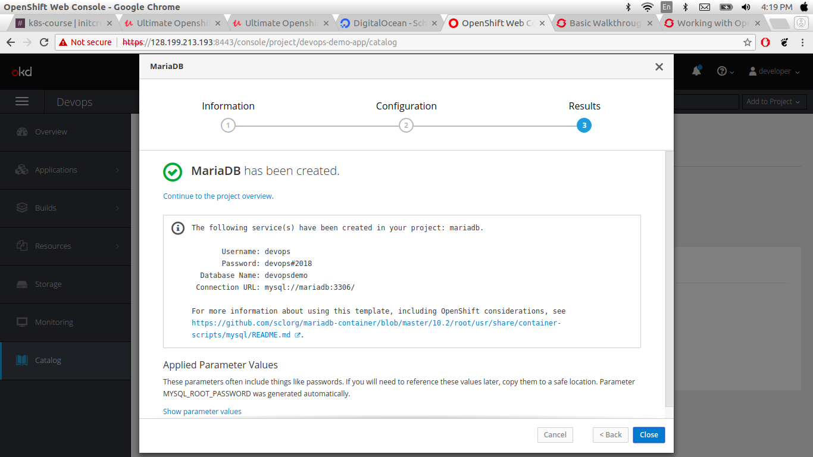

### Service Discovert, Deploying and conneting to a database

In this section we gonna to connect databse to you r application Deployment on the database.

Here, we are connect to mariaDB database.

* Go to overview
 
In the overview section openshift shows you in right side **Add to Project** click on this and select databases and either you can use mysql or maraiaDB. MariaDB is just the fork of mysql database.

After selecting the database provide some configuration of the databes like databae name, database connection, database password etc

