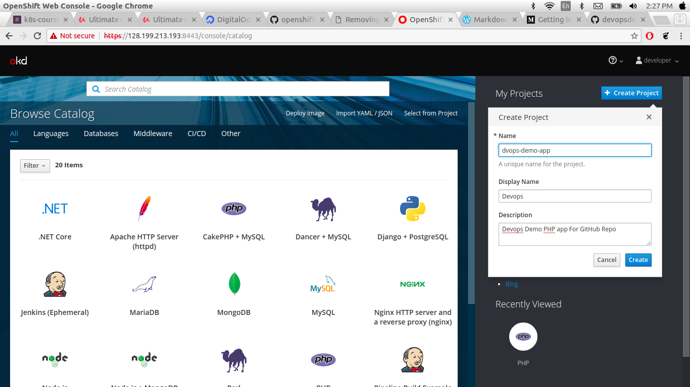

### Openshift the Kubernetes way
#### Creating a project and switching context
In this section we are deploying instavote app app from GitHub repo.
we use the same cluster earlier deployed simple aaplication with diffrent project namespace.
This docs demonstrates how to get a simple project up and running on OpenShift. Application that will serve a welcome page Welcome to the DevOps Demo Application.

* Go to Home Page.
* click on create project.
* Enter the project name Display name and describtions.


Download git repo. using following command.

```
git clone https://github.com/schoolofdevops/openshift-code.git
cd openshift-code/
```

### OpenShift CommandLine
 When we are using OpenShift many of the tasks that you need to do can be performed through the OpenShift web Broser console or directly using the oc command line tool. or you can observe here backed utility.

 In this case we need the OpenShift token . we can create token using opnshift web console click on user Devloper and there is option copy login command click on this paste on your console.

 

 ```
  oc login https://128.199.213.193:8443 --token=< your token>
 ```
 [output]

 ```
 Logged into "https://128.199.213.193:8443" as "developer" using the token provided.
You have access to the following projects and can switch between them with 'oc project <projectname>':
    devops-demo-app
  * myproject
Using project "myproject".

```
 here display your all the project with the curent project namespace.
you can swaitch your project namespace using following Command

check how many projects are present using following command.

```
oc projects
```
[ouput]

```
You have access to the following projects and can switch between them with 'oc project <projectname>':

    instavote - instavote app stack
  * myproject - My Project

Using project "myproject" on server "https://128.199.213.193:8443".
```
switch one project to another project using following command.

```
oc project instavote
```
[ouput]

```
Now using project "instavote" on server "https://128.199.213.193:8443".
```
check the context using following command.

```
oc config get-contexts
```
[output]

```
CURRENT   NAME                                             CLUSTER                AUTHINFO                            NAMESPACE
          /128-199-213-193:8443/developer                  128-199-213-193:8443   developer/128-199-213-193:8443
          default/128-199-213-193:8443/system:admin        128-199-213-193:8443   system:admin/128-199-213-193:8443   default
          devops-demo-app/128-199-213-193:8443/developer   128-199-213-193:8443   developer/128-199-213-193:8443      devops-demo-app
*         instavote/128-199-213-193:8443/developer         128-199-213-193:8443   developer/128-199-213-193:8443      instavote
          myproject/128-199-213-193:8443/developer         128-199-213-193:8443   developer/128-199-213-193:8443      myproject

```
#### Writing a pod spec and applying it with oc cli

In this section we talking about how to write pod spec Kubernetes way and deploy it on openshift. openshift underneath uses Kubernetes just see [openshift docs](https://docs.openshift.com/container-platform/3.10/welcome/index.html) . you can see here kubernetes all spec.
openshift extends kubernetes api on top of kubernetes. we will start how to write pod spec. just clone repo.

```
git clone https://github.com/schoolofdevops/openshift-code.git
cd openshift-code/pods/

```
##### Writing Pod Spec
Lets now create the Pod config by adding the kind and specs to schme given in the file vote-pod.yaml as follows.
```
apiVersion: v1
kind:
metadata:
spec:
```
Lets edit this and add the pod specs

```
apiVersion: v1
kind: Pod
metadata:
  name: vote
  labels:
    app: python
    role: vote
    version: v1
spec:
  containers:
    - name: app
      image: schoolofdevops/vote:v1
      ports:
        - containerPort: 80
          protocol: TCP
```

##### Launching and operating a Pod

use the following command to check syntax of yaml file

```
oc apply -f vote-pod.yaml --dry-run
```
use the following command to create pod . just remove --dry-run.

```
oc apply -f vote-pod.yaml
```

```
oc get pods
```
[output]
```
NAME      READY     STATUS    RESTARTS   AGE
vote      1/1       Running   0          22s
```

after few seconds shows pods status error because it can't connect port 80. here port 80 need root access that why it not working. openshift does not allow root privilege .

just see the the security policy.

```
oc get scc
```   
[output]

```
Error from server (Forbidden): securitycontextconstraints.security.openshift.io is forbidden: User "developer" cannot list securitycontextconstraints.security.openshift.io at the cluster scope: User "developer" cannot list all securitycontextconstraints.security.openshift.io in the cluster
```
```
find / -type f -name admin.kubeconfig
```
[output]

```
/home/openshift.local.clusterup/kube-apiserver/admin.kubeconfig
/home/openshift.local.clusterup/openshift-controller-manager/admin.kubeconfig
/home/openshift.local.clusterup/openshift-apiserver/admin.kubeconfig
/root/openshift.local.clusterup/kube-apiserver/admin.kubeconfig
/root/openshift.local.clusterup/openshift-controller-manager/admin.kubeconfig
/root/openshift.local.clusterup/openshift-apiserver/admin.kubeconfig
```
```
oc --config=/root/openshift.local.clusterup/kube-apiserver/admin.kubeconfig get scc
```
[output]

```
NAME               PRIV      CAPS      SELINUX     RUNASUSER          FSGROUP     SUPGROUP    PRIORITY   READONLYROOTFS   VOLUMES
anyuid             false     []        MustRunAs   RunAsAny           RunAsAny    RunAsAny    10         false            [configMap downwardAPI emptyDir persistentVolumeClaim projected secret]
hostaccess         false     []        MustRunAs   MustRunAsRange     MustRunAs   RunAsAny    <none>     false            [configMap downwardAPI emptyDir hostPath persistentVolumeClaim projected secret]
hostmount-anyuid   false     []        MustRunAs   RunAsAny           RunAsAny    RunAsAny    <none>     false            [configMap downwardAPI emptyDir hostPath nfs persistentVolumeClaim projected secret]
hostnetwork        false     []        MustRunAs   MustRunAsRange     MustRunAs   MustRunAs   <none>     false            [configMap downwardAPI emptyDir persistentVolumeClaim projected secret]
nonroot            false     []        MustRunAs   MustRunAsNonRoot   RunAsAny    RunAsAny    <none>     false            [configMap downwardAPI emptyDir persistentVolumeClaim projected secret]
privileged         true      [*]       RunAsAny    RunAsAny           RunAsAny    RunAsAny    <none>     false            [*]
restricted         false     []        MustRunAs   MustRunAsRange     MustRunAs   RunAsAny    <none>     false            [configMap downwardAPI emptyDir persistentVolumeClaim projected secret]
```

#### Rebuilding docker image with non privileged User and Port

In the previous section we try writing pod spec. but it won't work because port mapping . In this section we will rebuild the image with different privilege.

just clone the following repo.

```
git clone https://github.com/initcron/example-voting-app.git
cd example-voting-app/vote/
```
just edit Dockerfile

```
# Using official python runtime base image
FROM schoolofdevops/voteapp-python:v0.1.0

ARG user=app
ARG group=app
ARG uid=1000
ARG gid=1000

# Set the application directory
WORKDIR /app

# Install our requirements.txt
ADD requirements.txt /app/requirements.txt
RUN pip install -r requirements.txt

RUN addgroup -g ${gid} ${group} \
    && adduser  -u ${uid} -G ${group} -s /bin/sh -D ${user} \
    && chown -R ${user}:${group} /app

# Copy our code from the current folder to /app inside the container
ADD . /app

# Make port 80 available for links and/or publish
EXPOSE 8080

USER ${user}

# Define our command to be run when launching the container
CMD ["gunicorn", "app:app", "-b", "0.0.0.0:8080", "--log-file", "-", "--access-logfile", "-", "--workers", "4", "--keep-alive", "0"]
```
then build

```
docker build -t initcron/oc-vote:v1
```

then push image your docker hub registry .

```
docker push initcron/oc-vote:v1
```
then change pod spec.

```
apiVersion: v1
kind: Pod
metadata:
  name: vote
  labels:
    app: python
    role: vote
    version: v1
spec:
  containers:
    - name: app
      image: initcron/oc-vote:v1

```

then run following CMD


```
oc apply -f vote-pod.yml
```

#### Pod operations -  connect with shell, check logs, attach,  delete
This section we are looking about some of pod operation. start with following command.

```
oc get pods
```
[output]
```
NAME      READY     STATUS    RESTARTS   AGE
vote      1/1       Running   14         54m
```
```
oc get pods -o wide
```
[output]
```
NAME      READY     STATUS    RESTARTS   AGE       IP           NODE
vote      1/1       Running   14         55m       172.17.0.3   localhost
```

```
oc descibe pod vote
```
[output]

```
Name:         vote
Namespace:    instavote
Node:         localhost/128.199.213.193
Start Time:   Wed, 17 Oct 2018 12:59:34 +0000
Labels:       app=python
              role=vote
              version=v1
Annotations:  kubectl.kubernetes.io/last-applied-configuration={"apiVersion":"v1","kind":"Pod","metadata":{"annotations":{},"labels":{"app":"python","role":"vote","version":"v1"},"name":"vote","namespace":"instavot...
              openshift.io/scc=restricted
Status:       Running
IP:           172.17.0.3
Containers:
  app:
    Container ID:   docker://e71c8b4e1f2da2b07a3fb030ae4d81e603d8d3764bb070a7aaef96bcab7c354e
    Image:          initcron/oc-vote:v1
    Image ID:       docker-pullable://initcron/oc-vote@sha256:b05f64d225a8671ecc09d22760a2c76bd65aaf50e12d00b31ab3b4fe6f377b06
    Port:           <none>
    Host Port:      <none>
    State:          Running
      Started:      Wed, 17 Oct 2018 13:46:31 +0000
    Last State:     Terminated
      Reason:       Error
      Exit Code:    1
      Started:      Wed, 17 Oct 2018 13:41:54 +0000
      Finished:     Wed, 17 Oct 2018 13:42:00 +0000
    Ready:          True
    Restart Count:  14
    Environment:    <none>
    Mounts:
      /var/run/secrets/kubernetes.io/serviceaccount from default-token-b4xlj (ro)
Conditions:
  Type           Status
  Initialized    True
  Ready          True
  PodScheduled   True
Volumes:
  default-token-b4xlj:
    Type:        Secret (a volume populated by a Secret)
    SecretName:  default-token-b4xlj
    Optional:    false
QoS Class:       BestEffort
Node-Selectors:  <none>
Tolerations:     <none>
Events:
  Type     Reason     Age                  From                Message
  ----     ------     ----                 ----                -------
  Normal   Scheduled  56m                  default-scheduler   Successfully assigned vote to localhost
  Normal   Pulled     54m (x5 over 56m)    kubelet, localhost  Container image "schoolofdevops/vote:v1" already present on machine
  Normal   Created    54m (x5 over 56m)    kubelet, localhost  Created container
  Normal   Started    54m (x5 over 56m)    kubelet, localhost  Started container
  Warning  BackOff    11m (x197 over 56m)  kubelet, localhost  Back-off restarting failed container
```
use following command to go inside container.

```
oc exec -it vote sh
```
```
/app $ cat /etc/issue
Welcome to Alpine Linux 3.4
Kernel \r on an \m (\l)

```
