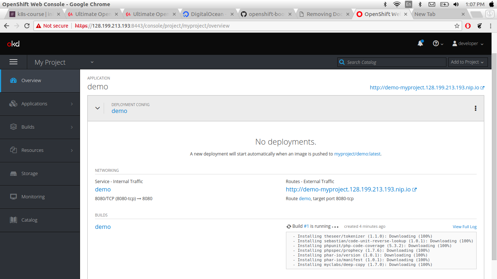
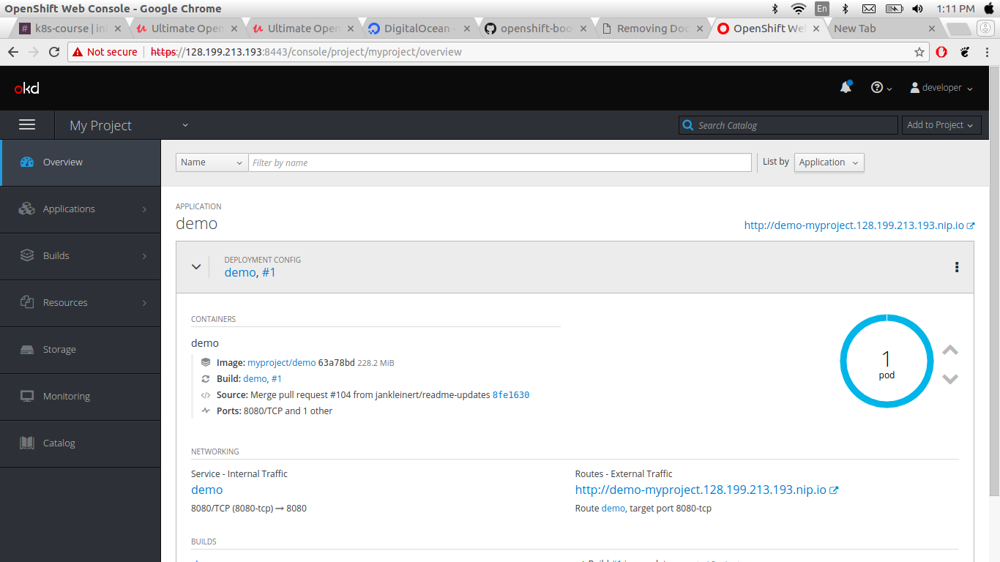
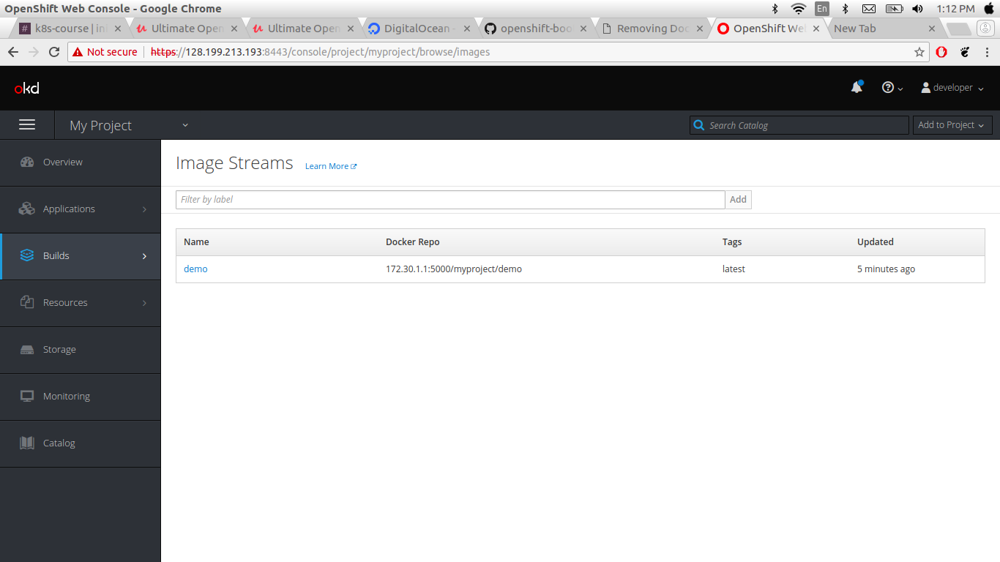

### Deploy First Openshift Application.
Let start to deploy our first sample application on openshift and you don't know have to docker and kubernetes because openshift is pass solution only need for the source code.
* Go to openshift UI


* Click on myproject
* Go to catalog and select php


* click next
* select the php version
* provide git repo.
```
https://github.com/openshift/cakephp-ex.git
```
* click next and close


* click Overview and see the builds



you can click on bulid it goes to build UI you can see here log, terminal, datails, Events


Once you build the image it automatically trigger new Depolyment. 

* Go to Overview

you can see here deployment



* Go to Build -> images

you can see here published images


