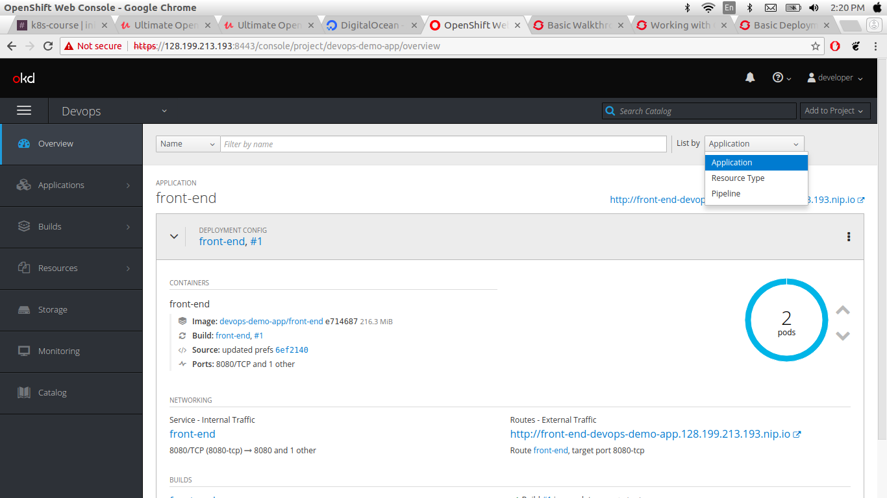
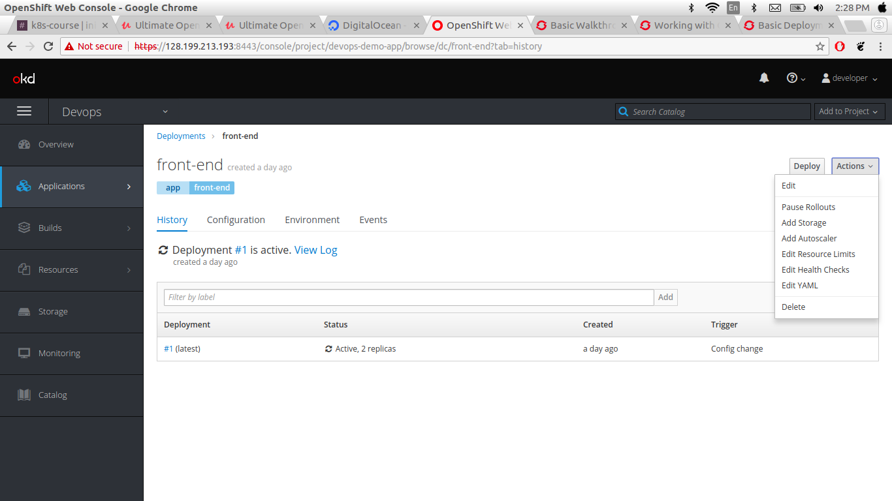
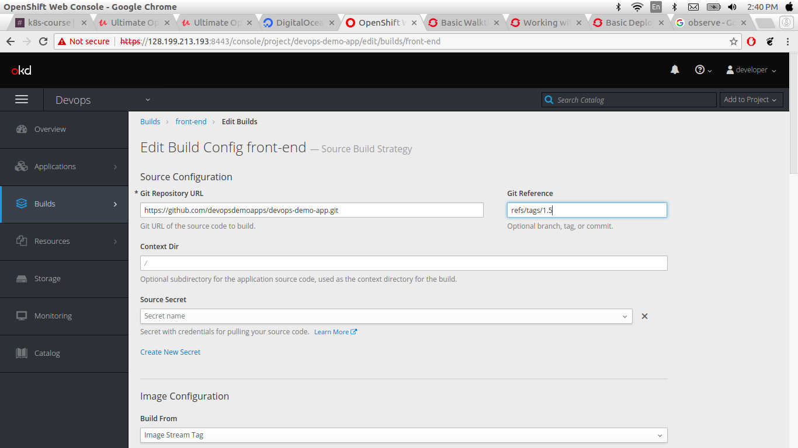

### Rolling out deployment a new version when application updated
In this section we gonna roll out application we alredy deployed here observe how that happen
* Go to the your project namespace
* Select the option overview
  * in overview you can see right side one applications labels there are three options
    1. Appications
    2. Resource Type
    3. Pipeline

you can see here also your application buid information



* Go to Applications -> Deployment -> front-end

In deployment shows you currrent deployment for taht application and the right side you can see **Deploy** and **Actions** two lables
in actions labels you can see multiple options.
* Edit
* Pause Rollut
* Add Stroage
* Add Autoscaler
* Edit Resource Limit
* Edit Helth Checks
* Edit yaml
* delete

And you can observe here
* History
* Configuration
* Environments
* Events
infor


* Go to Application -> Deployment -> front-end -> Applications -> Edit

  Here, OepenShift shows you multiple options of Deployment Statrgy you can provide info here to Deployment Startegy


* Go to Builds -> Build

  In this section openshift shows you in right side two options start Build and Actions


* select Actions -> Edit and create new Build

  Here, select Advance option and change the version for applications then save when you click on save openshift automatically build your application rollut build.




you can also use following command to see the history and status of your application rollout.

Rollout History

```
oc rollout history dc/front-end
```
[output]
```
REVISION	STATUS		CAUSE
1		Complete	config change
2		Complete	manual change

```
Rollout Status
```
oc rollout status dc/front-end
```
[output]

```
Waiting for rollout to finish: 0 out of 4 new replicas have been updated...
Waiting for rollout to finish: 0 out of 4 new replicas have been updated...
Waiting for rollout to finish: 1 out of 4 new replicas have been updated...
Waiting for rollout to finish: 1 out of 4 new replicas have been updated...
Waiting for rollout to finish: 1 out of 4 new replicas have been updated...
Waiting for rollout to finish: 1 out of 4 new replicas have been updated...
Waiting for rollout to finish: 1 out of 4 new replicas have been updated...
Waiting for rollout to finish: 2 out of 4 new replicas have been updated...
Waiting for rollout to finish: 2 out of 4 new replicas have been updated...
Waiting for rollout to finish: 2 out of 4 new replicas have been updated...
Waiting for rollout to finish: 2 out of 4 new replicas have been updated...
Waiting for rollout to finish: 2 out of 4 new replicas have been updated...
Waiting for rollout to finish: 3 out of 4 new replicas have been updated...
Waiting for rollout to finish: 3 out of 4 new replicas have been updated...
Waiting for rollout to finish: 3 out of 4 new replicas have been updated...
Waiting for rollout to finish: 3 out of 4 new replicas have been updated...
Waiting for rollout to finish: 3 out of 4 new replicas have been updated...
Waiting for rollout to finish: 1 old replicas are pending termination...
Waiting for rollout to finish: 1 old replicas are pending termination...
Waiting for rollout to finish: 3 of 4 updated replicas are available...
Waiting for latest deployment config spec to be observed by the controller loop...
replication controller "front-end-3" successfully rolled out

```
